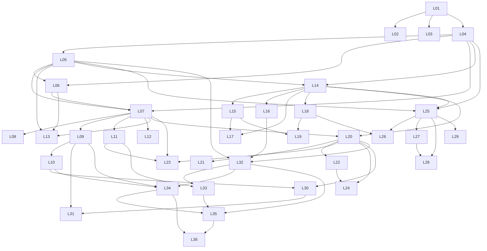

# Карта курса / Курс картасы

## Назначение / Мақсаты

**RU:** Научить начинающего учителя безопасно получать проверяемые учебные материалы и цифровые продукты в Higgsfield Supercomputer.

**KK:** Бастаушы мұғалімді Higgsfield Supercomputer ішінде қауіпсіз, тексерілетін оқу материалдары мен цифрлық өнімдер жасауға үйрету.

## Сквозные правила / Өтпелі ережелер

1. RU и KK имеют одинаковые цели, шаги, ограничения и критерии. / RU және KK мақсаттары, қадамдары, шектеулері мен өлшемшарттары бірдей.
2. Используются только обезличенные или синтетические данные. / Тек иесіздендірілген немесе синтетикалық деректер қолданылады.
3. Учитель проверяет факты, язык, возрастную уместность и права. / Мұғалім фактілерді, тілді, жасқа сәйкестікті және құқықтарды тексереді.
4. Роль ИИ указывается прозрачно. / ЖИ рөлі ашық көрсетіледі.
5. Непроверенные элементы UI получают обе метки: `[НУЖНА ПРОВЕРКА]` / `[ТЕКСЕРУ ҚАЖЕТ]`.
6. Визуальный стиль светлый и минималистичный; в человеческих сценах — женщины-учителя. / Визуалдық стиль ашық және минималистік; адам бар көріністерде — әйел мұғалімдер.
7. Каждый сценарий рассчитан максимум на 2–3 минуты. / Әр сценарий ең көбі 2–3 минутқа есептеледі.

## Уроки / Сабақтар

| ID | Трек | Тема RU | Тақырып KK | Prerequisites | Артефакт RU / KK | Вложение | Готовность RU |
|---|---|---|---|---|---|---|---|
| L01 | 0-foundation | ИИ-помощник и объяснение | ЖИ көмекшісі және түсіндіру | — | Объяснение на 80–120 слов с тремя применениями и одним ограничением. / Үш қолдану тәсілі мен бір шектеуі бар 80–120 сөздік түсіндірме. | text, md | Названы три применения. / Есть одно конкретное ограничение. / Ответ модели не назван источником истины. |
| L02 | 0-foundation | Память помощника и контекст | Көмекші жады және контекст | L01 | Один скрин или коллаж двух обезличенных диалогов с подписью различия. / Айырмашылығы түсіндірілген екі иесіздендірілген диалогтың бір скрині немесе коллажы. | screenshot, png, jpg | Видны два диалога. / Использована одна и та же проверяемая задача. / Различие объяснено без утверждения о непроверенной функции памяти. |
| L03 | 0-foundation | Разные модели и сравнение результатов | Әртүрлі модельдер және нәтижелерді салыстыру | L01 | Таблица сравнения двух результатов и обоснованный выбор. / Екі нәтижені салыстыру кестесі және негізделген таңдау. | text, md, pdf | Задача одинакова. / Критерии применены к обоим вариантам. / Выбор подтверждён примерами из результатов. |
| L04 | 0-foundation | Почему помощник не понимает: Р-З-К-Ф | Көмекші неге түсінбейді: Р-Т-К-Ф | L01 | Пара «до/после» с разметкой четырёх частей и двумя результатами. / Төрт бөлігі белгіленген «бұрын/кейін» жұбы және екі нәтиже. | text, screenshot, pdf | Все четыре части отмечены. / Улучшение наблюдаемо. / Исходная учебная цель не изменилась. |
| L05 | 0-foundation | Безопасный обезличенный запрос | Қауіпсіз иесіздендірілген сұрау | L04 | Обезличенный запрос и краткий список удалённых рисков. / Иесіздендірілген сұрау және жойылған тәуекелдердің қысқа тізімі. | text, md | Нет прямых и косвенных идентификаторов. / Смысл задачи сохранён. / Использованы диапазоны или синтетические данные. |
| L06 | 0-foundation | Фактчекинг и токены | Фактчекинг және токендер | L04, L05 | Ошибка с источником и план экономии из трёх конкретных мер. / Дереккөзі көрсетілген қате және үш нақты үнемдеу шарасы. | text, md, pdf | Источник позволяет воспроизвести проверку. / Исправление отделено от исходного ответа. / Указаны три меры экономии. |
| L07 | A-text | Конспект урока | Сабақ конспектісі | L04, L05, L06 | Файл конспекта с целями, таблицей этапов и оцениванием. / Мақсаттары, кезеңдер кестесі және бағалауы бар конспект файлы. | file, docx, pdf, md | Цель наблюдаема. / Тайминг сходится. / Оценивание проверяет заявленную цель. |
| L08 | A-text | КТП и годовой план | КТЖ және жылдық жоспар | L07 | Файл КТП/КТЖ минимум на один учебный период. / Кемінде бір оқу кезеңіне арналған КТЖ файлы. | file, xlsx, csv, docx, pdf | Часы не превышены. / Предшествующие знания учтены. / Контрольные точки распределены реалистично. |
| L09 | A-text | Три уровня заданий | Үш деңгейлі тапсырмалар | L07 | Три варианта задания: с опорой, базовый и расширенный. / Үш тапсырма нұсқасы: тірекпен, негізгі және кеңейтілген. | text, md, pdf | Все варианты ведут к одной цели. / Поддержка различается явно. / Ни один уровень не маркирует способности ребёнка. |
| L10 | A-text | Тест с ключами | Жауап кілті бар тест | L09 | Тест из 10 вопросов с ключом и объяснением каждого ответа. / Әр жауабының кілті мен түсіндірмесі бар 10 сұрақтық тест. | file, docx, pdf, md, yaml | Ровно десять вопросов. / У каждого вопроса один обоснованный ключ. / Нет подсказок формой или длиной ответа. |
| L11 | A-text | Карточки и раздаточный материал | Карточкалар және үлестірме материал | L07 | Файл минимум с четырьмя печатными карточками. / Кемінде төрт баспа карточкасы бар файл. | file, pdf, docx | Карточки пронумерованы. / Текст читается в печатном масштабе. / Инструкция и ожидаемый ответ однозначны. |
| L12 | A-text | Сценарий мероприятия | Іс-шара сценарийі | L07 | Файл сценария мероприятия с таблицей этапов. / Кезеңдер кестесі бар іс-шара сценарийінің файлы. | file, docx, pdf, md | Сумма этапов и переходов сходится. / Участие не принудительное. / План B работает без отказавшего ресурса. |
| L13 | A-text | Аналитика обезличенных таблиц | Иесіздендірілген кестелерді талдау | L05, L06, L07 | Аналитическая записка с тремя наблюдениями, двумя гипотезами и планом проверки. / Үш бақылауы, екі болжамы және тексеру жоспары бар талдамалық жазба. | file, csv, xlsx, md, pdf | Нет идентификаторов. / Числа воспроизводимы. / Гипотезы не представлены как доказанные причины. |
| L14 | B-visual | Учебная иллюстрация | Оқу иллюстрациясы | L04, L05 | Одна учебная иллюстрация и подпись с её назначением. / Бір оқу иллюстрациясы және оның мақсатын түсіндіретін жазба. | image, png, jpg | Иллюстрация поддерживает цель. / Нет лишних или неверных деталей. / Подпись объясняет способ использования. |
| L15 | B-visual | Пять дидактических карточек | Бес дидактикалық карточка | L14 | Пять карточек в одном файле или архиве. / Бір файлдағы немесе архивтегі бес карточка. | image_set, pdf, zip, png | Ровно пять карточек. / Нумерация и порядок ясны. / Все карточки используют одну систему. |
| L16 | B-visual | Учебный постер | Оқу постері | L14 | Один учебный постер для экрана или печати. / Экранға немесе баспаға арналған бір оқу постері. | image, pdf, png, jpg | Одна доминирующая мысль. / Текст читаем. / Декор не мешает содержанию. |
| L17 | B-visual | ОВЗ: раскраска и визуальная опора | ЕБҚ: бояу және визуалдық тірек | L14, L15 | Два материала: контурная раскраска и пошаговая визуальная опора. / Екі материал: контурлық бояу парағы және қадамдық визуалдық тірек. | image_set, pdf, png | Приложены два разных материала. / Нет диагноза или ярлыка. / Контраст, пространство и инструкция доступны. |
| L18 | B-visual | Три картинки в одном стиле | Бір стильдегі үш сурет | L14 | Серия из трёх картинок и краткий паспорт стиля. / Үш суреттен тұратын серия және қысқа стиль паспорты. | image_set, zip, png, jpg, pdf | Ровно три изображения. / Персонаж и палитра узнаваемо стабильны. / Различия между сценами намеренные. |
| L19 | B-visual | Проверенная учебная карточка | Тексерілген оқу карточкасы | L15, L18 | Финальная карточка и заполненный чек-лист ручной сверки. / Соңғы карточка және толтырылған қолмен салыстыру чек-парағы. | image, pdf, png | Каждая строка текста проверена. / Числа и подписи точны. / Указан использованный источник. |
| L20 | C-presentation | Презентация из одной просьбы | Бір сұраудан презентация | L07, L14 | Презентация ровно из семи слайдов. / Дәл жеті слайдтан тұратын презентация. | file, pptx, pdf | Ровно семь слайдов. / На каждом слайде одна главная мысль. / Финальный слайд проверяет понимание. |
| L21 | C-presentation | Презентация со своими картинками | Өз суреттері бар презентация | L20 | Обновлённая презентация минимум с тремя своими изображениями. / Кемінде үш өз суреті енгізілген жаңартылған презентация. | file, pptx, pdf | Использованы минимум три изображения. / Права и источники зафиксированы. / Изображения поддерживают содержание. |
| L22 | C-presentation | Оформление слайда: было и стало | Слайдты безендіру: бұрын және кейін | L20 | Один слайд «было/стало» с пояснением трёх улучшений. / Үш жақсартуы түсіндірілген бір «бұрын/кейін» слайды. | file, pptx, pdf, image | Обе версии видны. / Объяснены минимум три изменения. / Смысл и факты не искажены. |
| L23 | C-presentation | Полный комплект урока | Сабақтың толық жинағы | L07, L11, L20 | Архив или папка: конспект, раздатка и презентация. / Архив немесе бума: конспект, үлестірме және презентация. | file_set, zip, pdf, pptx, docx | Присутствуют три части. / Инструкции и ответы согласованы. / Файлы открываются и названы понятно. |
| L24 | C-presentation | Презентация из подробного технического задания | Толық техникалық тапсырмадан презентация | L20, L22 | Презентация и заполненная матрица «требование → доказательство». / Презентация және толтырылған «талап → дәлел» матрицасы. | file, pptx, pdf, md | Все требования перечислены. / Для каждого есть доказательство. / Невыполненные пункты не скрыты. |
| L25 | D-video | Ролик-вступление 30–60 секунд | 30–60 секундтық кіріспе ролик | L04, L05, L14 | Вступительный ролик длительностью 30–60 секунд. / Ұзақтығы 30–60 секунд болатын кіріспе ролик. | video, mp4 | Длительность 30–60 секунд. / Хук связан с темой. / Зритель понимает следующее действие. |
| L26 | D-video | Мультфильм-объяснение | Түсіндіру мультфильмі | L18, L25 | Короткий объясняющий мультфильм и сториборд. / Қысқа түсіндіру мультфильмі және сториборд. | video, mp4, storyboard | Сюжет объясняет понятие. / Ключевые объекты стабильны. / Финальный вывод соответствует источнику. |
| L27 | D-video | Видео-разминка | Видео сергіту | L25 | Видео-разминка с тремя-пятью простыми движениями. / Үш-бес қарапайым қимылы бар видео сергіту. | video, mp4 | Темп позволяет повторять. / Есть предупреждение остановиться при дискомфорте. / Альтернатива равноценна по участию. |
| L28 | D-video | Склейка роликов | Роликтерді біріктіру | L25, L27 | Один смонтированный ролик минимум из трёх клипов. / Кемінде үш клиптен монтаждалған бір ролик. | video, mp4 | Использовано минимум три клипа. / Порядок понятен. / Нет резких случайных скачков звука. |
| L29 | D-video | Подписи на экране | Экрандағы жазулар | L25 | Видео с синхронными подписями и текстовая расшифровка. / Синхронды жазулары бар видео және мәтіндік транскрипт. | video, mp4, transcript | Подписи соответствуют речи или действию. / Текст успевает читаться. / Контраст достаточен. |
| L30 | E-interactive | Игра-викторина | Ойын-викторина | L10, L20 | Ссылка или файл игры-викторины с минимум пятью вопросами. / Кемінде бес сұрағы бар ойын-викторина сілтемесі немесе файлы. | link, html, file | Минимум пять вопросов. / Ответы совпадают с ключами. / Обратная связь объясняет, а не только оценивает. |
| L31 | E-interactive | Предметная учебная игра | Пәндік оқу ойыны | L09, L30 | Работающая предметная игра и краткая инструкция учителю. / Жұмыс істейтін пәндік ойын және мұғалімге қысқа нұсқау. | link, html, file | Механика служит учебной цели. / Правила понятны без устного дополнения. / Сложность меняется без смены цели. |
| L32 | E-interactive | Сайт класса | Сынып сайты | L05, L16, L20 | Рабочая ссылка на сайт класса и скрин главной страницы. / Сынып сайтының жұмыс істейтін сілтемесі және басты бет скрині. | link, screenshot | Нет персональных данных. / Все основные ссылки работают. / Пользователь понимает назначение сайта. |
| L33 | E-interactive | Страница с тремя и более материалами | Үш немесе одан көп материалы бар бет | L11, L32 | Рабочая страница минимум с тремя материалами. / Кемінде үш материалы бар жұмыс істейтін бет. | link, screenshot | Есть минимум три материала. / Каждая ссылка открывается. / Описание помогает выбрать нужный материал. |
| L34 | E-interactive | Интерактивный тренажёр | Интерактивті жаттықтырғыш | L09, L10, L32 | Работающий тренажёр минимум с пятью заданиями. / Кемінде бес тапсырмасы бар жұмыс істейтін жаттықтырғыш. | link, html, file | Минимум пять заданий. / Каждая попытка даёт корректную обратную связь. / Можно безопасно начать заново. |
| L35 | F-building | Учебный сайт-платформа | Оқу сайт-платформасы | L32, L33, L34 | Рабочая платформа с тремя разделами и картой пользовательского пути. / Үш бөлімі және пайдаланушы жолының картасы бар жұмыс істейтін платформа. | link, screenshot, flow-map | Есть минимум три раздела. / Основной путь завершается результатом. / Ошибочные ссылки или пустые состояния обработаны. |
| L36 | F-building | Мини-приложение для учебной задачи | Оқу міндетіне арналған шағын қолданба | L34, L35 | Рабочее мини-приложение, ссылка и короткий протокол тестирования. / Жұмыс істейтін шағын қолданба, сілтеме және қысқа тестілеу хаттамасы. | link, screenshot, test-report | Вход, действие и результат воспроизводимы. / Пустой и ошибочный ввод обработаны. / Ограничения и роль ИИ видимы пользователю. |

## DAG

## Контрольные ворота / Бақылау қақпалары

- **G0 после L06:** безопасный запрос, проверенный факт и план экономии. / қауіпсіз сұрау, тексерілген факт және үнемдеу жоспары.
- **GA после L13:** проверенный текстовый пакет и анализ обезличенных данных. / тексерілген мәтіндік жинақ және иесіздендірілген деректер талдауы.
- **GB после L19:** визуальная серия и карточка прошли ручную проверку. / визуалдық серия мен карточка қолмен тексерілген.
- **GC после L24:** презентация соответствует подробному ТЗ. / презентация толық ТТ-ға сәйкес.
- **GD после L29:** видео имеет ясную цель, подписи и доступный эквивалент. / видеода анық мақсат, жазулар және қолжетімді балама бар.
- **GE после L34:** интерактив даёт корректную обратную связь. / интерактив дұрыс кері байланыс береді.
- **GF после L36:** приложение проверено по основному и ошибочным сценариям. / қолданба негізгі және қате сценарийлермен тексерілген.

## Definition of Done / Дайындық анықтамасы

Для каждого Lxx созданы `lesson.md`, `video-script.md`, `prompts.md`,
`assignment.md`, `quiz.yaml`, `qa-report.md`; RU/KK эквивалентны;
вложение открывается; факты и ключи проверены; UI подтверждён или отмечен
двумя метками; QA имеет статус PASS.

Әр Lxx үшін `lesson.md`, `video-script.md`, `prompts.md`, `assignment.md`,
`quiz.yaml`, `qa-report.md` жасалған; RU/KK тең; тіркеме ашылады;
фактілер мен кілттер тексерілген; UI расталған немесе екі белгімен
көрсетілген; QA мәртебесі — PASS.
